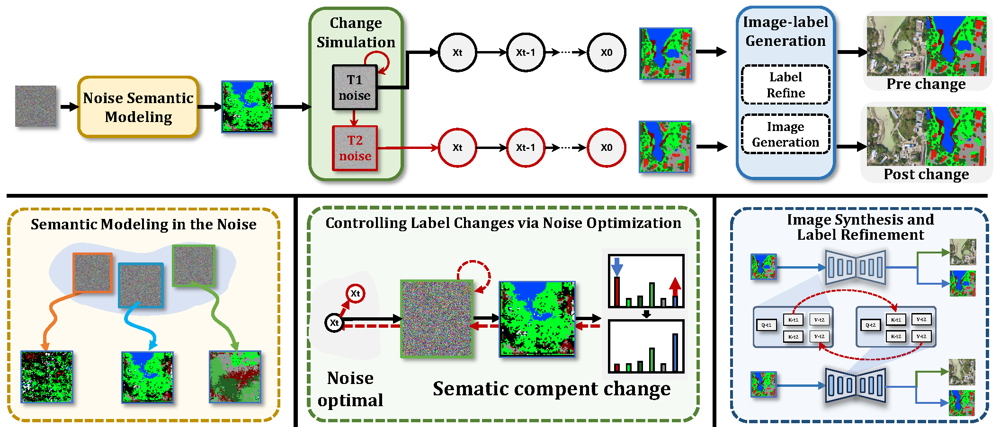

# Noise2Change: Generating Any Changes in the Noise Domain

<p align="center">
  
</p>

**Generating Any Changes in the Noise Domain**  
Q. Liu, Y. Kuang, J. Yue, P. Ghamisi, W. Xie, L. Fang  
*IEEE Transactions on Pattern Analysis and Machine Intelligence, 2025*

---

**Installation**

```bash
conda create -n noise2change python=3.10 -y
conda activate noise2change
pip install -r requirements.txt
```

---

**Pretrained models**

- **EDM2**: NVIDIA EDM2  
  [`edm2-img512-xs-2147483-0.135.pkl`](https://nvlabs-fi-cdn.nvidia.com/edm2/posthoc-reconstructions/edm2-img512-xs-2147483-0.135.pkl)
- **VAE**: StabilityAI  
  [`sd-vae-ft-mse`](https://huggingface.co/stabilityai/sd-vae-ft-mse)

---

**Data preparation**

```bash
bash preprocessing/run.sh
```

---

**Training**

Mask generator:

```bash
bash scripts/train/mask/train_mask_generator.sh
```

Image generator:

```bash
bash scripts/train/mask/train_image_generator.sh
```

---

**Generation**

Real T1 → synthetic T2:

```bash
# Encode T1 latents before T2
bash scripts/generate/mask/T2/generate_mask_T2.sh
bash scripts/generate/image/T2/generate_image_T2.sh
```

Fully synthetic (optional):

```bash
bash scripts/generate/mask/T1/generate_mask_T1.sh
bash scripts/generate/image/T1/generate_image_T1.sh
# Encode T1 latents before T2
bash scripts/generate/mask/T2/generate_mask_T2.sh
bash scripts/generate/image/T2/generate_image_T2.sh
```

---

**Citation**

```bibtex
@ARTICLE{10825310,
  author={Liu, Qingsong and Kuang, Yidan and Yue, Jun and Ghamisi, Pedram and Xie, Weiying and Fang, Leyuan},
  journal={IEEE Transactions on Pattern Analysis and Machine Intelligence},
  title={Generating Any Changes in the Noise Domain},
  year={2025},
  doi={10.1109/TPAMI.2025.3643733}
}
```

